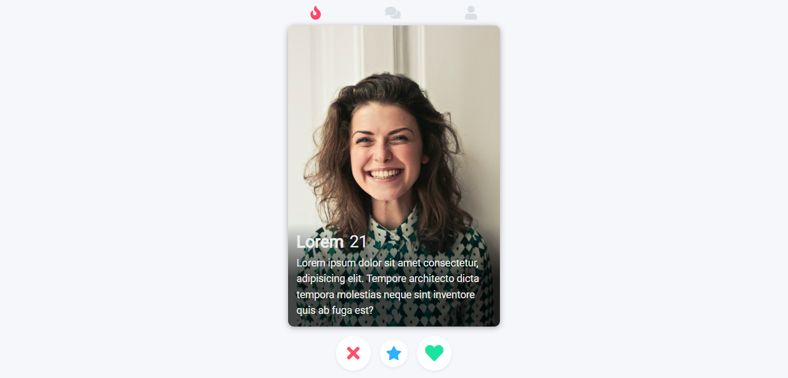

# Clone do Tinder

- Clone do Tinder usando HTML e CSS

## [Link do Projeto](https://lcamargodasilva.github.io/clone-tinder)

### Tecnologias que foram utilizada

 

 
<h4 align="center">
    Feito com 🖤 by <a href="https://www.linkedin.com/in/lcamargodasilva/" target="_blank">Lucas Camargo</a>
</h4>
